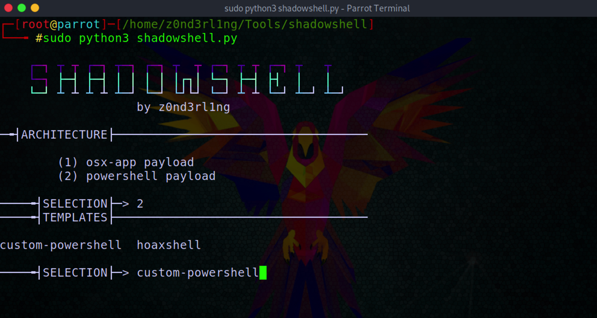

<h1>SHADOWSHELL</h1>

custom payload generator for silent reverse tcp shells - please keep in mind to use this tool for educational purposes only!

 

 <h3>GET STARTED</h3>

         install metasploit framework and python3

         set HOST and PORT in TEMPLATES and HANDLER before use
         
         sudo python3 shadowshell.py
